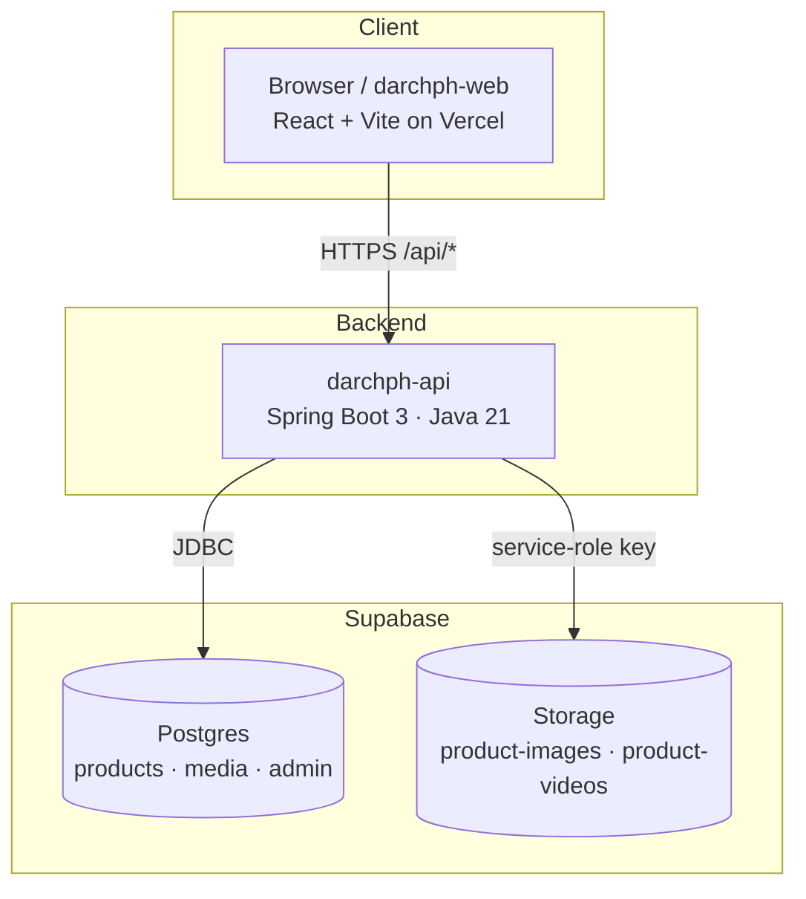
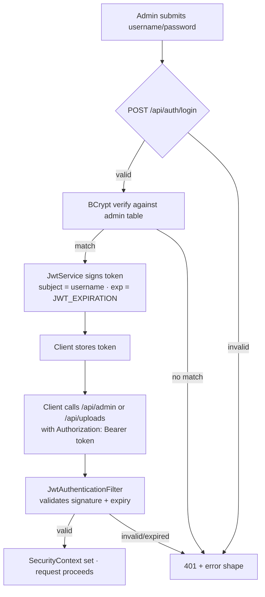
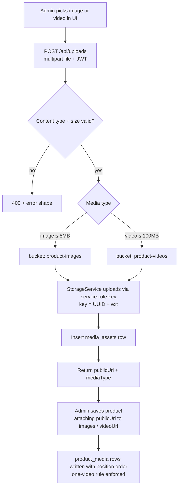
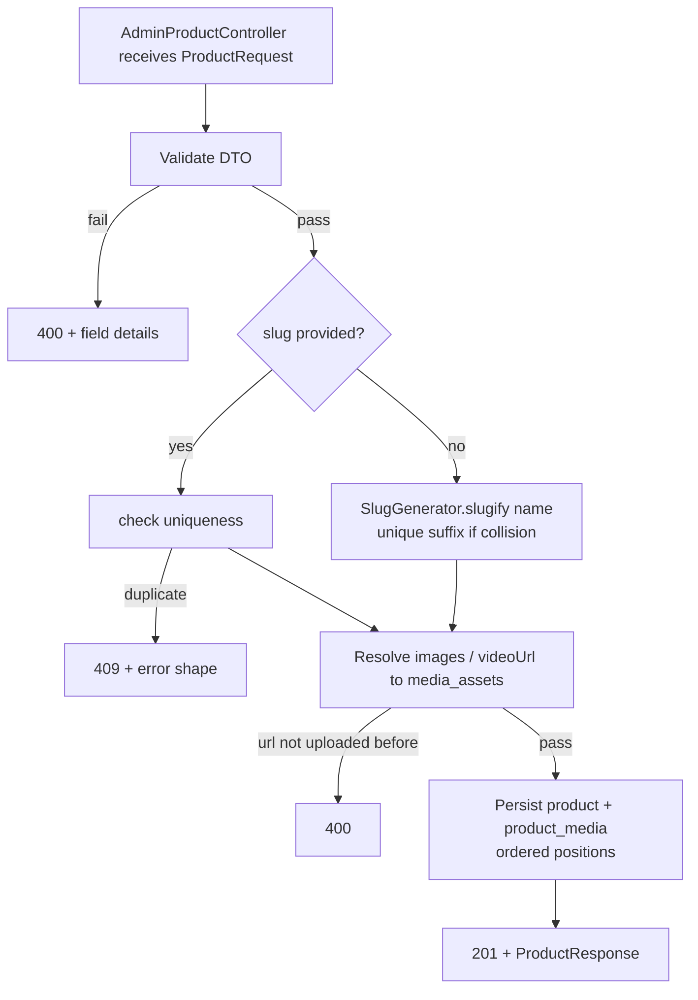
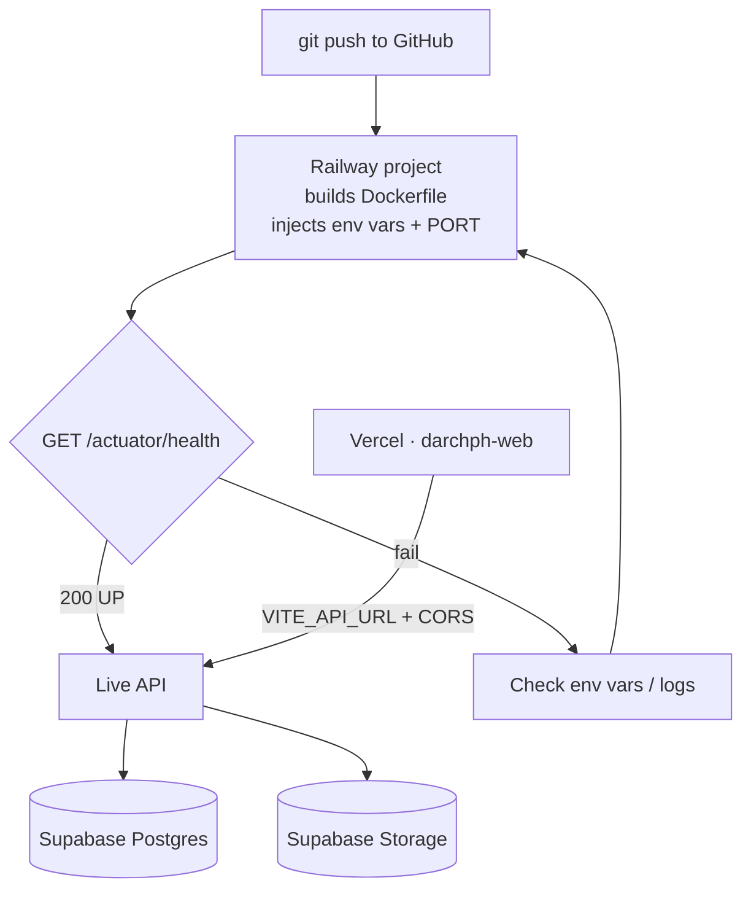

# darchph — Backend API

Online shop backend for **Darch PH** (laser-engraved products). Admin manages
product listings; customers browse a view-only storefront and initiate purchases
through a per-product **BUY NOW** link that redirects to an external platform.

This repository is the **Spring Boot backend**. The frontend is a separate
repository (`darchph-web`, React + Vite, deployed on Vercel).

> Full technical design: [`plans/project_overview.md`](./plans/project_overview.md)
> Implementation tracker: [`plans/TASK_INDEX.md`](./plans/TASK_INDEX.md)

---

## Table of Contents

- [Architecture](#architecture)
- [Repositories](#repositories)
- [Tech Stack](#tech-stack)
- [Project Structure](#project-structure)
- [Prerequisites](#prerequisites)
- [Local Setup](#local-setup)
- [Coding Standards](#coding-standards)
- [API Overview](#api-overview)
- [How It Works](#how-it-works)
- [Testing](#testing)
- [Deployment](#deployment)
- [Security Notes](#security-notes)

---

## Architecture

The backend is the **only** component that talks to Supabase (Postgres + Storage).
The frontend never holds Supabase secrets — all data flows through this API.



---

## Repositories

| Repo          | Stack                          | Host             | Purpose                       |
| ------------- | ------------------------------ | ---------------- | ----------------------------- |
| `darchph`     | Spring Boot 3, Java 21, Maven  | Railway (primary) / Render (fallback) | This API      |
| `darchph-web` | React 18 + Vite + Tailwind     | Vercel           | Storefront + admin UI         |

---

## Tech Stack

- **Java 21** (LTS), **Spring Boot 3.x**, **Maven**
- Spring Web, Spring Data JPA + Hibernate, Spring Security
- Flyway (schema migrations), BCrypt (passwords), JWT (stateless auth)
- Supabase Postgres (DB) + Supabase Storage (media)
- Springdoc OpenAPI, Testcontainers (tests), Lombok (optional)

---

## Project Structure

```
src/main/java/ph/darch/api/
├─ config/          # Security, CORS, Storage, OpenAPI beans
├─ controller/      # Auth, Product (public), AdminProduct, Upload
├─ dto/             # Requests, responses, error shape
├─ entity/          # Admin, Product, MediaAsset, ProductMedia
├─ exception/       # Domain exceptions + GlobalExceptionHandler
├─ repository/      # Spring Data repositories
├─ security/        # JwtService, JwtAuthenticationFilter
├─ service/         # Auth, Product, AdminProduct, Upload, Storage, seed
└─ util/            # SlugGenerator, helpers

src/main/resources/
├─ application.yml  # Env-driven configuration
└─ db/migration/    # Flyway V1__init.sql
```

Layering rule: `controller → service → repository`, entities/DTOs are never
shared between controllers directly (DTOs in, DTOs out).

---

## Prerequisites

- JDK 21 (`JAVA_HOME` set)
- Maven 3.9+ (or use `./mvnw`)
- A Supabase project (Postgres + Storage buckets `product-images`, `product-videos`)
- Docker (only needed for Testcontainers tests)

---

## Local Setup

### 1. Environment variables

Copy `.env.example` and fill in real values:

```bash
cp .env.example .env
```

Required variables (also the exact set used in deployment):

| Variable                | Purpose                                 |
| ----------------------- | --------------------------------------- |
| `DATABASE_URL`          | Supabase Postgres JDBC URL              |
| `DB_USER`               | DB user                                 |
| `DB_PASSWORD`           | DB password                             |
| `JWT_SECRET`            | ≥ 32 random chars, signs JWTs           |
| `JWT_EXPIRATION`        | Token TTL seconds (default 86400)       |
| `SUPABASE_URL`          | e.g. `https://<ref>.supabase.co`        |
| `SUPABASE_SERVICE_KEY`  | Service-role key (server-side only)     |
| `CORS_ALLOWED_ORIGINS`  | Comma-separated allowed frontend origins|
| `ADMIN_USERNAME`        | Seeded admin username                   |
| `ADMIN_PASSWORD`        | Seeded admin password                   |

### 2. Run

```bash
./mvnw spring-boot:run
```

The API starts on `http://localhost:8080` (override with `SERVER_PORT`).

- Health check: `GET /actuator/health`
- OpenAPI UI: `http://localhost:8080/swagger-ui/index.html`
- Flyway applies the schema automatically on startup.

### 3. First login

```bash
curl -X POST http://localhost:8080/api/auth/login \
  -H "Content-Type: application/json" \
  -d '{"username":"admin","password":"yourpassword"}'
```

Returns `{ "token": "<jwt>" }` — send it as `Authorization: Bearer <jwt>` on
admin/upload endpoints.

---

## Coding Standards

Keep it **clean and simple** — optimize for readability and maintenance, not cleverness.

1. **Layers** — `controller → service → repository`. Controllers only map HTTP to
   service calls and return DTOs. No business logic in controllers or entities.
2. **DTOs in, DTOs out** — never return entities to clients; never accept entities
   from clients. Build responses with a dedicated mapper (`ProductMapper`).
3. **Naming** — classes PascalCase, methods/variables camelCase, DB columns
   `snake_case`. Controllers: `*Controller`. Services: `*Service`. Repos: `*Repository`.
4. **Single responsibility** — one class, one job. A service that grows beyond ~200
   lines should be split (e.g., `UploadService` vs `StorageService`).
5. **Validation at the edge** — Bean Validation annotations on request DTOs; fail
   fast with `400` + the standard error shape. Keep services free of manual checks
   for things annotations already cover.
6. **Enums over strings** — use `MediaType { IMAGE, VIDEO }`, persisted as strings.
7. **No `System.out`** — use SLF4J `log.info/debug/warn/error`. Never log secrets
   (passwords, JWT secrets, service keys).
8. **Exceptions** — use the shared domain exceptions
   (`NotFoundException`, `BadRequestException`, `ConflictException`,
   `UnauthorizedException`) mapped once in `GlobalExceptionHandler`. Don't throw
   framework exceptions from services.
9. **Comments** — only when they explain *why*, never *what*. Prefer expressive
   names over comments.
10. **Tests** — every behavior has a test. Unit for pure logic, MockMvc for HTTP
    flows, Testcontainers for anything touching the DB.

---

## API Overview

Base URL: `http://localhost:8080/api` (production: your deployed domain).

Error shape (all endpoints):

```json
{
  "timestamp": "2026-08-18T00:00:00Z",
  "status": 400,
  "error": "Validation failed",
  "details": { "field": "message" },
  "path": "/api/products"
}
```

### Auth

| Method | Path            | Auth | Description                       |
| ------ | --------------- | ---- | --------------------------------- |
| POST   | `/auth/login`   | —    | `{ username, password }` → `{ token }` |
| GET    | `/auth/me`      | Admin| Current admin identity            |

### Products (public — no token)

| Method | Path               | Description                                   |
| ------ | ------------------ | --------------------------------------------- |
| GET    | `/products`        | Active products. Params: `page`, `size`, `sort`, `search`, `featured` |
| GET    | `/products/{slug}` | Active product detail (404 if missing/inactive) |

### Admin products (JWT required)

| Method | Path                   | Description                    |
| ------ | ---------------------- | ------------------------------ |
| GET    | `/admin/products`      | All products (incl. inactive)  |
| GET    | `/admin/products/{id}` | Single product                 |
| POST   | `/admin/products`      | Create                         |
| PUT    | `/admin/products/{id}` | Full update                    |
| PATCH  | `/admin/products/{id}` | Partial update (e.g. `isActive`) |
| DELETE | `/admin/products/{id}` | Delete (also removes media)    |

### Uploads (JWT required)

| Method | Path        | Description                                      |
| ------ | ----------- | ------------------------------------------------ |
| POST   | `/uploads`  | Multipart image/video → `{ publicUrl, mediaType }` |

### Product payload

```json
{
  "name": "Personalized Wooden Keychain",
  "slug": "personalized-wooden-keychain",
  "description": "Engraved maple keychain...",
  "price": 250.00,
  "currency": "PHP",
  "images": ["https://.../product-images/abc.jpg"],
  "videoUrl": "https://.../product-videos/ghi.mp4",
  "buyUrl": "https://shopee.ph/product-link",
  "isActive": true,
  "featured": false
}
```

---

## How It Works

### Authentication flow



### Media upload flow



### Admin product create flow



---

## Testing

```bash
./mvnw test
```

- **Unit**: `SlugGenerator`, `JwtService`, `UploadService` validation, one-video rule.
- **Integration (MockMvc)**: auth flow, public listing, admin CRUD, uploads, cleanup.
- **DB tests**: Testcontainers Postgres — Flyway runs automatically, no live
  Supabase needed to run the suite.

See [`plans/TASK_7.md`](./plans/TASK_7.md) for the full testing spec.

---

## Deployment

Backend deploys to **Railway** (primary) with **Render** as documented fallback.
Frontend deploys separately to Vercel (see `darchph-web`).



Steps (details in [`plans/TASK_8.md`](./plans/TASK_8.md)):

1. Push this repo to GitHub.
2. On Railway: **New Project → Deploy from GitHub repo**.
3. Set all env vars from [Local Setup](#local-setup).
4. Railway builds the Dockerfile and injects `PORT` → the app binds `SERVER_PORT` (defaults to `8080`).
5. Point `VITE_API_URL` (Vercel) at the deployed domain; add the Vercel origin to
   `CORS_ALLOWED_ORIGINS`.

---

## Security Notes

Attackers can hit the public API and try the admin endpoints, so security is
treated as part of the build (see [`plans/TASK_9.md`](./plans/TASK_9.md)):

- **Rate limiting (in-app)** — Bucket4j token buckets: login (5 / 15 min per IP
  **and** per IP+username), admin (60/min per IP), uploads (30/hour + 50/day per IP),
  public reads (240/min). Over-limit → `429` + `Retry-After`.
- **DDoS / edge** — Cloudflare (free) in front of the API: proxied DNS, bot
  mitigation, edge rate-limit rules matching the in-app limits, and Under Attack
  mode for incidents. Railway spending limit set.
- **Admin login** — identical `401` for unknown user vs wrong password (no user
  enumeration); startup fails fast if `ADMIN_PASSWORD` < 16 chars; JWT TTL
  defaults to 4 h; optional `ADMIN_IP_ALLOWLIST` for `/api/admin/**`.
- **Uploads** — magic-byte validation (rejects HTML/SVG/scripts masquerading as
  media), size caps (image ≤ 5 MB, video ≤ 100 MB), per-IP quotas, random UUID
  filenames, at most one video per product.
- **Headers** — `X-Content-Type-Options: nosniff`, `X-Frame-Options: DENY`,
  `Referrer-Policy: no-referrer`, `Cache-Control: no-store` on auth routes, HSTS
  when TLS-terminated.
- **Surface reduction** — actuator exposes `health` only; stack traces never
  included in prod responses; Swagger/OpenAPI disabled in prod.
- **Secrets** — `DB_PASSWORD`, `JWT_SECRET`, `SUPABASE_SERVICE_KEY` exist only in
  platform env vars — never in git, logs, or the frontend.
- **Audit logging** — failed logins (IP + username) and all admin mutations are
  logged; tokens/passwords/secrets are never logged.