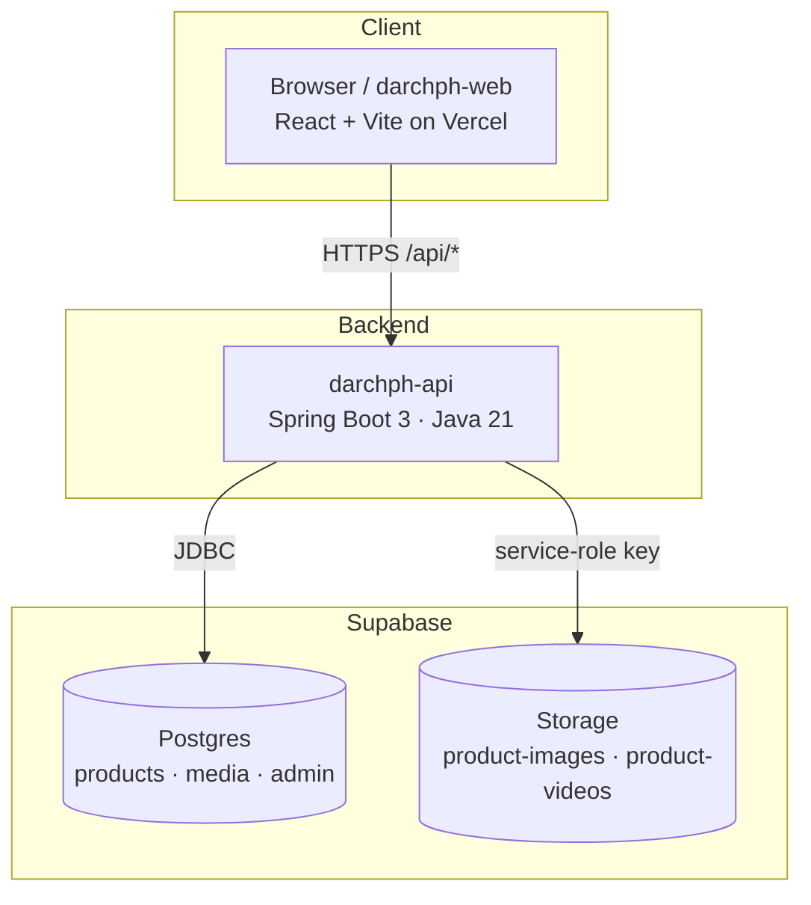
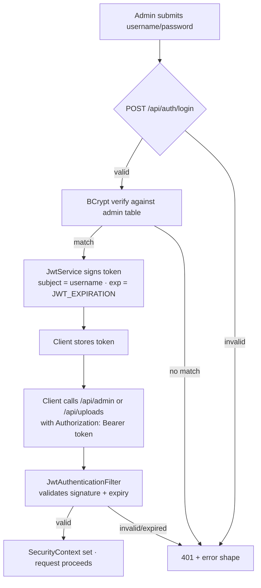
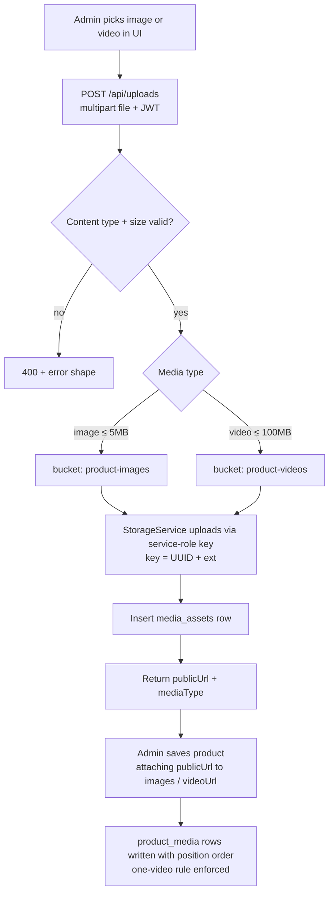
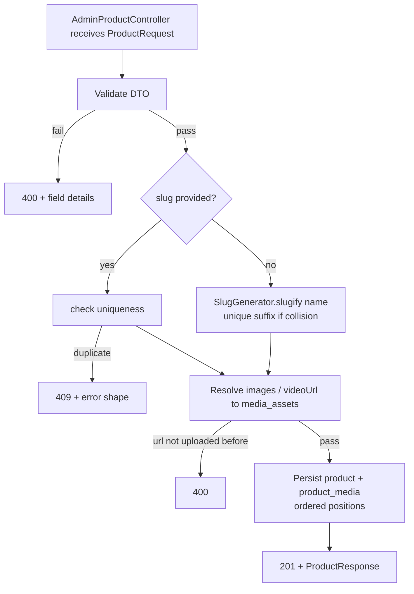
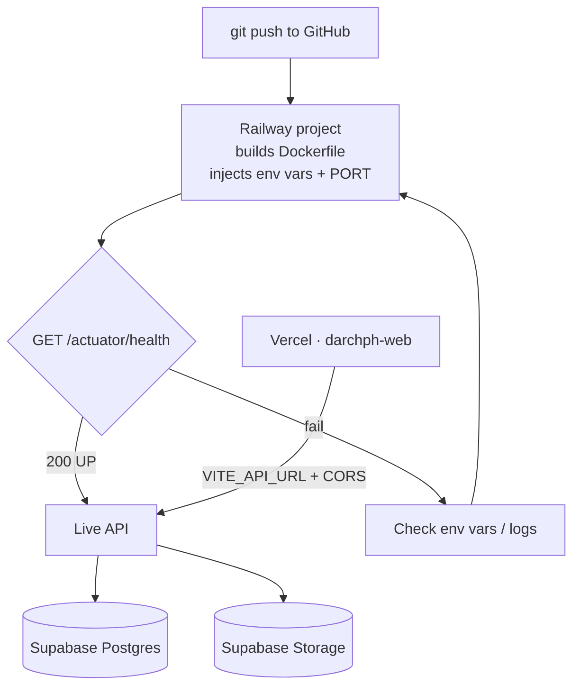

# darchph — Backend API

Online shop backend for **Darch PH** (laser-engraved products). Admin manages
product listings; customers browse a view-only storefront and initiate purchases
through a per-product **BUY NOW** link that redirects to an external platform.

This repository is the **Spring Boot backend**. The frontend is a separate
repository (`darchph-web`, React + Vite, deployed on Vercel).

> Full technical design: [`plans/project_overview.md`](./plans/project_overview.md)
> Implementation tracker: [`plans/TASK_INDEX.md`](./plans/TASK_INDEX.md)

---

## Table of Contents

- [Architecture](#architecture)
- [Repositories](#repositories)
- [Tech Stack](#tech-stack)
- [Project Structure](#project-structure)
- [Prerequisites](#prerequisites)
- [Local Setup](#local-setup)
- [Coding Standards](#coding-standards)
- [API Reference](#api-reference-for-frontend-integration)
- [How It Works](#how-it-works)
- [Testing](#testing)
- [Deployment](#deployment)
- [Security Notes](#security-notes)

---

## Architecture

The backend is the **only** component that talks to Supabase (Postgres + Storage).
The frontend never holds Supabase secrets — all data flows through this API.



---

## Repositories

| Repo          | Stack                          | Host             | Purpose                       |
| ------------- | ------------------------------ | ---------------- | ----------------------------- |
| `darchph`     | Spring Boot 3, Java 21, Maven  | Railway (primary) / Render (fallback) | This API      |
| `darchph-web` | React 18 + Vite + Tailwind     | Vercel           | Storefront + admin UI         |

---

## Tech Stack

- **Java 21** (LTS), **Spring Boot 3.x**, **Maven**
- Spring Web, Spring Data JPA + Hibernate, Spring Security
- Flyway (schema migrations), BCrypt (passwords), JWT (stateless auth)
- Supabase Postgres (DB) + Supabase Storage (media)
- Springdoc OpenAPI, Testcontainers (tests), Lombok (optional)

---

## Project Structure

```
src/main/java/ph/darch/api/
├─ config/          # Security, CORS, Storage, OpenAPI beans
├─ controller/      # Auth, Product (public), AdminProduct, Upload
├─ dto/             # Requests, responses, error shape
├─ entity/          # Admin, Product, MediaAsset, ProductMedia
├─ exception/       # Domain exceptions + GlobalExceptionHandler
├─ repository/      # Spring Data repositories
├─ security/        # JwtService, JwtAuthenticationFilter
├─ service/         # Auth, Product, AdminProduct, Upload, Storage, seed
└─ util/            # SlugGenerator, helpers

src/main/resources/
├─ application.yml  # Env-driven configuration
└─ db/migration/    # Flyway V1__init.sql
```

Layering rule: `controller → service → repository`, entities/DTOs are never
shared between controllers directly (DTOs in, DTOs out).

---

## Prerequisites

- JDK 21 (`JAVA_HOME` set)
- Maven 3.9+ (or use `./mvnw`)
- A Supabase project (Postgres + Storage buckets `product-images`, `product-videos`)
- Docker (only needed for Testcontainers tests)

---

## Local Setup

### 1. Environment variables

Copy `.env.example` and fill in real values:

```bash
cp .env.example .env
```

Required variables (also the exact set used in deployment):

| Variable                | Purpose                                 |
| ----------------------- | --------------------------------------- |
| `DATABASE_URL`          | Supabase Postgres JDBC URL              |
| `DB_USER`               | DB user                                 |
| `DB_PASSWORD`           | DB password                             |
| `JWT_SECRET`            | ≥ 32 random chars, signs JWTs           |
| `JWT_EXPIRATION`        | Token TTL seconds (default 14400 = 4h)  |
| `SUPABASE_URL`          | e.g. `https://<ref>.supabase.co`        |
| `SUPABASE_SERVICE_KEY`  | Service-role key (server-side only)     |
| `CORS_ALLOWED_ORIGINS`  | Comma-separated allowed frontend origins|
| `ADMIN_USERNAME`        | Seeded admin username                   |
| `ADMIN_PASSWORD`        | Seeded admin password                   |

### 2. Run

```bash
./mvnw spring-boot:run
```

The API starts on `http://localhost:8080` (override with `SERVER_PORT`).

- Health check: `GET /actuator/health`
- OpenAPI UI: `http://localhost:8080/swagger-ui/index.html`
- Flyway applies the schema automatically on startup.

**Calling from the local frontend:** point the frontend at
`http://localhost:8080/api`. Ensure your frontend dev origin (e.g. Vite's
`http://localhost:5173`) is included in the comma-separated
`CORS_ALLOWED_ORIGINS` value so the browser does not block requests. A sample
value is already present in `.env.example`.

### 3. First login

```bash
curl -X POST http://localhost:8080/api/auth/login \
  -H "Content-Type: application/json" \
  -d '{"username":"admin","password":"yourpassword"}'
```

Returns `{ "token": "<jwt>" }` — send it as `Authorization: Bearer <jwt>` on
admin/upload endpoints.

---

## Coding Standards

Keep it **clean and simple** — optimize for readability and maintenance, not cleverness.

1. **Layers** — `controller → service → repository`. Controllers only map HTTP to
   service calls and return DTOs. No business logic in controllers or entities.
2. **DTOs in, DTOs out** — never return entities to clients; never accept entities
   from clients. Build responses with a dedicated mapper (`ProductMapper`).
3. **Naming** — classes PascalCase, methods/variables camelCase, DB columns
   `snake_case`. Controllers: `*Controller`. Services: `*Service`. Repos: `*Repository`.
4. **Single responsibility** — one class, one job. A service that grows beyond ~200
   lines should be split (e.g., `UploadService` vs `StorageService`).
5. **Validation at the edge** — Bean Validation annotations on request DTOs; fail
   fast with `400` + the standard error shape. Keep services free of manual checks
   for things annotations already cover.
6. **Enums over strings** — use `MediaType { IMAGE, VIDEO }`, persisted as strings.
7. **No `System.out`** — use SLF4J `log.info/debug/warn/error`. Never log secrets
   (passwords, JWT secrets, service keys).
8. **Exceptions** — use the shared domain exceptions
   (`NotFoundException`, `BadRequestException`, `ConflictException`,
   `UnauthorizedException`) mapped once in `GlobalExceptionHandler`. Don't throw
   framework exceptions from services.
9. **Comments** — only when they explain *why*, never *what*. Prefer expressive
   names over comments.
10. **Tests** — every behavior has a test. Unit for pure logic, MockMvc for HTTP
    flows, Testcontainers for anything touching the DB.

---

## API Reference (for Frontend Integration)

> This section is the **single source of truth** for the frontend team. Every
> endpoint, field, payload, and error code is documented here with real shapes.
> In production / when hosted, replace `http://localhost:8080` with your deployed
> base URL (e.g. `https://darchph-api.onrender.com`).

- **Base URL:** `http://localhost:8080`
- **Everything under `/api` is JSON.** Endpoint paths below are relative to `/api`.
- **Auth:** Bearer JWT. Get a token from `POST /auth/login`, then send
  `Authorization: Bearer <token>` on admin + upload endpoints.
- **Interactive docs (Swagger UI):** `http://localhost:8080/swagger-ui/index.html`
- **Raw OpenAPI JSON:** `http://localhost:8080/v3/api-docs`

### Error shape (all endpoints)

Every non-2xx response uses this exact JSON body:

```json
{
  "timestamp": "2026-08-18T00:00:00Z",
  "status": 400,
  "error": "Validation failed",
  "details": { "field": "message" },
  "path": "/api/products"
}
```

| Field       | Type   | Notes                                            |
| ----------- | ------ | ------------------------------------------------ |
| `timestamp` | string | ISO-8601 instant                                 |
| `status`    | number | HTTP status code                                 |
| `error`     | string | Short, human-readable reason                     |
| `details`   | object | Field → message map (present on validation/400)  |
| `path`      | string | Request path that produced the error             |

Common status codes you must handle in the frontend:

| Code | Meaning                                   |
| ---- | ----------------------------------------- |
| 400  | Validation failed / malformed body / bad param / media rules |
| 401  | Missing or invalid token, or bad login credentials |
| 403  | Authenticated but not allowed             |
| 404  | Resource not found                        |
| 409  | Conflict (e.g. duplicate slug)            |
| 502  | Upstream storage failure                  |

---

### Product object (response)

A product is returned by the public and admin endpoints. Field names are
**camelCase** as shown.

```json
{
  "id": 5,
  "name": "Personalized Wooden Keychain",
  "slug": "personalized-wooden-keychain",
  "description": "Engraved maple keychain for gifting",
  "price": 250.00,
  "currency": "PHP",
  "images": ["https://cdn.supabase.co/public/img-a0.jpg"],
  "videoUrl": "https://cdn.supabase.co/public/vid-a.mp4",
  "buyUrl": "https://shopee.ph/product-link",
  "isActive": true,
  "featured": true,
  "createdAt": "2026-08-18T00:00:00Z",
  "updatedAt": "2026-08-18T00:00:00Z"
}
```

| Field         | Type    | Notes                                                      |
| ------------- | ------- | ---------------------------------------------------------- |
| `id`          | number  | Primary key                                                |
| `name`        | string  | Required, ≤ 200 chars                                      |
| `slug`        | string  | URL-safe identifier, lowercase + dashes. Auto-generated from name if omitted. ≤ 240 chars |
| `description` | string  | May be empty string                                        |
| `price`       | number  | ≥ 0, up to 2 decimals                                      |
| `currency`    | string  | 3-letter code, defaults to `"PHP"`                         |
| `images`      | string[]| Ordered public URLs (index 0 = primary/thumbnail). Omitted-if-empty → `[]` |
| `videoUrl`    | string  | Optional, ≤ 1 video per product. **Omitted from JSON when null** |
| `buyUrl`      | string  | External purchase link for BUY NOW (http/https). Required  |
| `isActive`    | boolean | `true` = visible on public storefront                      |
| `featured`    | boolean | `true` = featured on storefront                            |
| `createdAt`   | string  | ISO-8601 instant                                           |
| `updatedAt`   | string  | ISO-8601 instant                                           |

> Serialization notes: with `jackson.default-property-inclusion: non_null`,
> **null** fields are omitted from JSON. `images` is serialized as `[]` when
> there are no images (it is never null), but `videoUrl` is **absent** when no
> video exists. Treat a missing `videoUrl` as "no video" in the frontend.

### Paged response (for listings)

```json
{
  "content": [ /* Product[] */ ],
  "page": 0,
  "size": 20,
  "totalElements": 42,
  "totalPages": 3
}
```

| Field           | Type     | Notes                                  |
| --------------- | -------- | -------------------------------------- |
| `content`       | Product[]| The items on this page                 |
| `page`          | number   | Zero-based current page number         |
| `size`          | number   | Items requested per page               |
| `totalElements` | number   | Total items across all pages           |
| `totalPages`    | number   | Total number of pages                  |

---

## Public API — no token required

### POST `/auth/login`

Admin login. Returns a JWT that must be stored client-side and sent on all
admin/upload requests.

**Request body:**

```json
{
  "username": "admin",
  "password": "yourpassword"
}
```

**Success `200`:**

```json
{
  "token": "<jwt>"
}
```

**Failures:** `400` (missing/blank username or password), `401` with
`{ "error": "Invalid username or password" }` (same body for unknown user vs
wrong password — do not surface which one).

> Store the token (e.g. `localStorage`) and send it as
> `Authorization: Bearer <token>` on every admin/upload call.

### GET `/products`

List **active** products with filtering and pagination. No token needed.

**Query parameters (all optional):**

| Param     | Type    | Default        | Notes                                      |
| --------- | ------- | -------------- | ------------------------------------------ |
| `page`    | number  | `0`            | Zero-based page index                      |
| `size`    | number  | `20`           | Items per page (1–100)                     |
| `sort`    | string  | `createdAt,desc` | `createdAt` \| `name` \| `price` + `,asc`/`,desc` |
| `search`  | string  | —              | Case-insensitive match on name or description |
| `featured`| boolean | —              | `true` = only featured active products     |

**Example:** `GET /api/products?size=12&sort=price,asc&featured=true`

**Success `200`:** a [paged response](#paged-response-for-listings). Inactive
products are never returned here.

### GET `/products/{slug}`

Get a single **active** product by its slug (not id). No token needed.

**Example:** `GET /api/products/personalized-wooden-keychain`

**Success `200`:** a [product object](#product-object-response).
**Failure `404`:** if the slug is missing or the product is inactive.

---

## Admin API — JWT required

All endpoints below require `Authorization: Bearer <token>`.
Without a valid token → `401`.

### GET `/auth/me`

Returns the current authenticated admin. Requires token.

**Success `200`:**

```json
{
  "username": "admin"
}
```

**Failure `401`:** missing or invalid token.

### GET `/admin/products`

List **all** products (including inactive) with the same filters as the public
listing. Requires token.

**Query parameters (all optional):** `page`, `size`, `sort`, `search` (same as
above) **plus** `isActive` (`true`/`false` to filter by active state).

**Success `200`:** a [paged response](#paged-response-for-listings).

### GET `/admin/products/{id}`

Get a single product by numeric **id** (including inactive). Requires token.

**Success `200`:** a [product object](#product-object-response).
**Failure `404`:** id not found.

### POST `/admin/products`

Create a product. Requires token. Returns `201 Created`.

**[Product request payload] — same shape as the response product, minus the
read-only fields:**

```json
{
  "name": "Personalized Wooden Keychain",
  "slug": "personalized-wooden-keychain",
  "description": "Engraved maple keychain...",
  "price": 250.00,
  "currency": "PHP",
  "images": ["https://cdn.supabase.co/public/img-a0.jpg"],
  "videoUrl": "https://cdn.supabase.co/public/vid-a.mp4",
  "buyUrl": "https://shopee.ph/product-link",
  "isActive": true,
  "featured": false
}
```

| Field         | Type    | Required | Default | Validation rules                              |
| ------------- | ------- | -------- | ------- | --------------------------------------------- |
| `name`        | string  | **yes**  | —       | ≤ 200 chars                                   |
| `slug`        | string  | no       | auto    | lowercase letters/digits + single dashes, ≤ 240. If omitted, generated from `name` (unique-suffixed on collision) |
| `description` | string  | no       | `""`    | ≤ 5000 chars                                  |
| `price`       | number  | **yes**  | —       | ≥ 0, ≤ 10 digits before decimal, ≤ 2 decimals |
| `currency`    | string  | no       | `"PHP"` | exactly 3 letters                             |
| `images`      | string[]| no       | `[]`    | ≤ 10 URLs; each must have been uploaded via `POST /uploads` |
| `videoUrl`    | string  | no       | —       | http/https URL; ≤ 1 video per product (images + video combined) |
| `buyUrl`      | string  | **yes**  | —       | must be `http://` or `https://`, ≤ 2048 chars |
| `isActive`    | boolean | no       | `true`  | —                                            |
| `featured`    | boolean | no       | `false` | —                                            |

**Success `201`:** the created [product object](#product-object-response).
**Failures:** `400` (validation / image URL not previously uploaded / more than
one video), `409` (explicit duplicate `slug`).

### PUT `/admin/products/{id}`

**Full update** — replaces the product and its media. The whole payload is
expected (mirrors `POST`). Media not present in the request is removed.

**Success `200`:** the updated [product object](#product-object-response).
**Failures:** same as `POST` (`400`, `409`), plus `404` if id not found.

### PATCH `/admin/products/{id}`

**Partial update** — only include the fields you want to change. Requires token.

**Example — toggle active & set price:**

```json
{
  "isActive": false,
  "price": 320.50
}
```

| Field      | Type    | Notes                                          |
| ---------- | ------- | ---------------------------------------------- |
| `name`     | string  | ≤ 200 chars, non-blank                         |
| `slug`     | string  | triggers uniqueness check, `409` on conflict   |
| `description` | string | —                                            |
| `price`    | number  | ≥ 0                                            |
| `currency` | string  | exactly 3 letters                              |
| `buyUrl`   | string  | must be http(s) URL                            |
| `isActive` | boolean | —                                              |
| `featured` | boolean | —                                              |

Unknown fields are **ignored**. Returns `200` with the updated product object.
`404` if id not found.

### DELETE `/admin/products/{id}`

Hard-deletes a product **and its media** (product_media rows, then orphaned
`media_assets` + Supabase Storage objects). Requires token.

**Success `204 No Content`** (empty body). **Failure `404`** if id not found.

---

## Uploads — JWT required

### POST `/uploads`

Uploads a single image or video to Supabase Storage and returns its public URL.
The returned `publicUrl` is what you pass into a product's `images` / `videoUrl`.

Use **multipart/form-data** with a part named `file`. Requires token.

**Allowed media types & size caps:**

| Media     | Content types                  | Max size | Bucket             |
| --------- | ------------------------------ | -------- | ------------------ |
| Image     | `image/jpeg`, `image/png`, `image/webp` | 5 MB  | `product-images`   |
| Video     | `video/mp4`, `video/webm`      | 100 MB   | `product-videos`   |

**Example (curl):**

```bash
curl -X POST http://localhost:8080/api/uploads \
  -H "Authorization: Bearer <token>" \
  -F "file=@/path/to/photo.jpg"
```

**Success `200`:**

```json
{
  "publicUrl": "https://<ref>.supabase.co/storage/v1/object/public/product-images/abc-123.jpg",
  "mediaType": "IMAGE"
}
```

| Field       | Type   | Notes                                  |
| ----------- | ------ | -------------------------------------- |
| `publicUrl` | string | Public URL to attach to a product      |
| `mediaType` | string | `IMAGE` or `VIDEO`                     |

**Failures:** `400` (unsupported type / empty file / too large, in `details.file`),
`401` (no token), `502` (storage upstream failure).

> The `mediaType` tells the frontend which product field to attach the URL to:
> `IMAGE` → `images[]`; `VIDEO` → `videoUrl`.

---

## Frontend integration summary (quick reference)

```
Base URL (dev):  http://localhost:8080           # full path below uses /api prefix
Base URL (prod): your deployed domain

PUBLIC (no auth):
  POST /auth/login                          -> { token }
  GET  /products?page&size&sort&search&featured   -> paged Product[]
  GET  /products/{slug}                     -> Product

ADMIN (Bearer token):
  GET  /auth/me                             -> { username }
  GET  /admin/products?page&size&sort&search&isActive -> paged Product[]
  GET  /admin/products/{id}                 -> Product
  POST /admin/products                      -> 201 Product
  PUT  /admin/products/{id}                 -> Product
  PATCH /admin/products/{id}                -> Product
  DELETE /admin/products/{id}               -> 204

ADMIN upload (Bearer token):
  POST /uploads  (multipart, part="file")   -> { publicUrl, mediaType }
```

Full interactive reference: `http://localhost:8080/swagger-ui/index.html`

---

## Local Setup (for the frontend dev)

1. Start the backend on `localhost:8080` (see [Local Setup](#local-setup) below
   in this README). Ensure it is running before hitting the API.
2. Set the frontend's API base URL to `http://localhost:8080/api`.
3. Confirm the frontend origin (e.g. `http://localhost:5173` for Vite) is listed
   in the backend's `CORS_ALLOWED_ORIGINS` so the browser allows the calls.
4. Log in via `POST /auth/login` to obtain a token, then call the admin endpoints
   with `Authorization: Bearer <token>`.

---

## How It Works

### Authentication flow



### Media upload flow



### Admin product create flow



---

## Testing

```bash
./mvnw test
```

- **Unit**: `SlugGenerator`, `JwtService`, `UploadService` validation, one-video rule.
- **Integration (MockMvc)**: auth flow, public listing, admin CRUD, uploads, cleanup.
- **DB tests**: Testcontainers Postgres — Flyway runs automatically, no live
  Supabase needed to run the suite.
- **Coverage**: JaCoCo writes a report to `target/site/jacoco/` after `./mvnw test`.

**CI**: a GitHub Actions workflow (`.github/workflows/ci.yml`) runs `./mvnw -B
verify` on every push/PR, so the whole suite is green-checked on each change.

See [`plans/TASK_7.md`](./plans/TASK_7.md) for the full testing spec.

---

## Deployment

Backend deploys to **Railway** (primary) with **Render** as documented fallback.
Frontend deploys separately to Vercel (see `darchph-web`).



Steps (details in [`plans/TASK_8.md`](./plans/TASK_8.md)):

1. Push this repo to GitHub.
2. On Railway: **New Project → Deploy from GitHub repo**.
3. Set all env vars from [Local Setup](#local-setup).
4. Railway builds the Dockerfile and injects `PORT` → the app binds `SERVER_PORT` (defaults to `8080`).
5. Point `VITE_API_URL` (Vercel) at the deployed domain; add the Vercel origin to
   `CORS_ALLOWED_ORIGINS`.

---

## Security Notes

Attackers can hit the public API and try the admin endpoints, so security is
treated as part of the build (see [`plans/TASK_9.md`](./plans/TASK_9.md)):

- **Rate limiting (in-app)** — Bucket4j token buckets: login (5 / 15 min per IP
  **and** per IP+username), admin (60/min per IP), uploads (30/hour + 50/day per IP),
  public reads (240/min). Over-limit → `429` + `Retry-After`.
- **DDoS / edge** — Cloudflare (free) in front of the API: proxied DNS, bot
  mitigation, edge rate-limit rules matching the in-app limits, and Under Attack
  mode for incidents. Railway spending limit set.
- **Admin login** — identical `401` for unknown user vs wrong password (no user
  enumeration); startup fails fast if `ADMIN_PASSWORD` < 16 chars; JWT TTL
  defaults to 4 h; optional `ADMIN_IP_ALLOWLIST` for `/api/admin/**`.
- **Uploads** — magic-byte validation (rejects HTML/SVG/scripts masquerading as
  media), size caps (image ≤ 5 MB, video ≤ 100 MB), per-IP quotas, random UUID
  filenames, at most one video per product.
- **Headers** — `X-Content-Type-Options: nosniff`, `X-Frame-Options: DENY`,
  `Referrer-Policy: no-referrer`, `Cache-Control: no-store` on auth routes, HSTS
  when TLS-terminated.
- **Surface reduction** — actuator exposes `health` only; stack traces never
  included in prod responses; Swagger/OpenAPI disabled in prod.
- **Secrets** — `DB_PASSWORD`, `JWT_SECRET`, `SUPABASE_SERVICE_KEY` exist only in
  platform env vars — never in git, logs, or the frontend.
- **Audit logging** — failed logins (IP + username) and all admin mutations are
  logged; tokens/passwords/secrets are never logged.